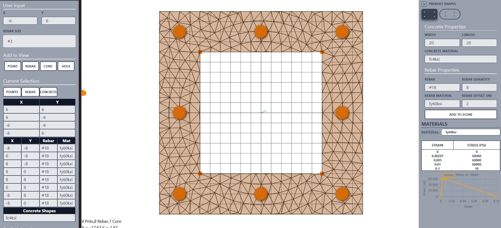
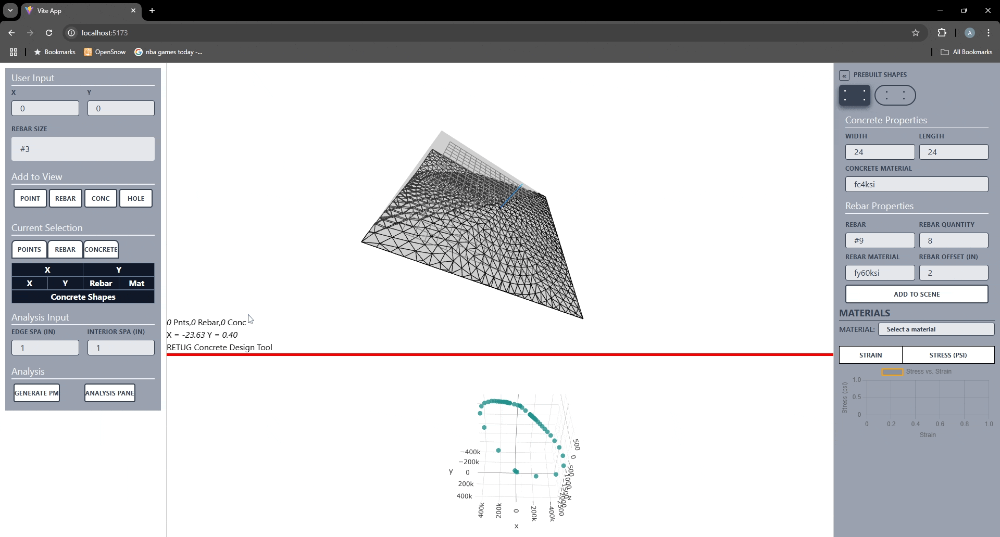

# concJS
Concrete design tool



recording



## Multi-material sections

Section polygons may overlap and each polygon has a numeric priority. The
higher-priority polygon governs an overlap (concrete defaults to `0`, steel to
`1`). Analysis resolves the polygons into disjoint FEM material regions,
automatically tightens the mesh for thin shapes, and reports resolved area by
material. Saved projects use schema version 2; version 1 projects remain
importable and receive material-based default priorities.

## Deploy to the RETUG Django site

Run the complete production build, Django-template conversion, and changed-file copy with:

```powershell
npm run deploy:retug
```

The deploy script copies only files whose SHA-256 hash changed. It publishes the Webpack bundle, Tailwind CSS, `disc.png`, and the generated `conc_gui.html` template to `C:\Users\16142\Desktop\re-tug_site`.

To preview what would change without copying anything:

```powershell
powershell -NoProfile -ExecutionPolicy Bypass -File scripts/deploy-retug.ps1 -DryRun
```

The Django template is generated from `index.html` by `scripts/generate-django-template.mjs`. Edit `index.html`, not `deployment/conc_gui.html`; the generator preserves the production Django static paths, Google Analytics setup, cookie consent, and disclaimer link, and fails if development-only asset paths remain.
