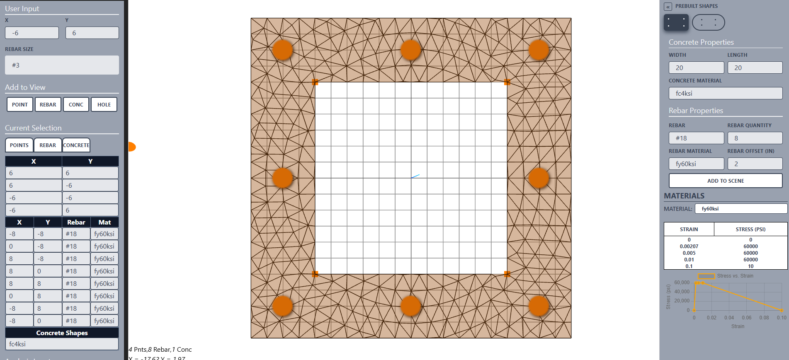
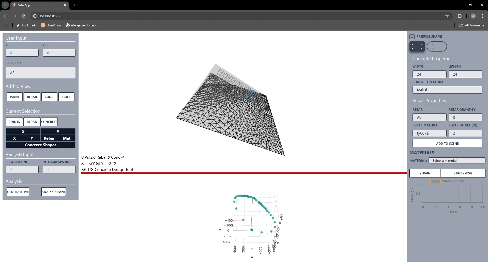

# concJS
Concrete design tool



recording



## Multi-material sections

Section polygons may overlap and each polygon has a numeric priority. The
higher-priority polygon governs an overlap (concrete defaults to `0`, steel to
`1`). Analysis resolves the polygons into disjoint FEM material regions,
automatically tightens the mesh for thin shapes, and reports resolved area by
material. Saved projects use schema version 3. Concrete materials require a
positive `compressiveStrengthACI` value in psi; projects created before this
field was introduced are not migrated automatically.

## Demand checks

After generating PMM, open **Demand checks** beside **3D PMM** and **Table**.
Add named, factored load combinations using P in kips and M2/M3 in kip-ft.
Compression is negative P; M2 maps to the analysis Mx and M3 to My, about the
section centroid. Click **Check demands** to calculate the ratios. Select a row,
then switch to **3D PMM** to see the demand and its capacity point. Input cases
and the selected DCR method are saved with the project; results must be
recalculated after editing demands, changing the method, or regenerating the section.

The default **Constant axial load (horizontal ray)** method holds P fixed and
casts from zero moment at the demand's axial load. In `(P, M2, M3)` coordinates,
capacity is `(P, λM2, λM3)` and `DCR = 1/λ`. The plotted ray stays horizontal in
that axial-load plane. For a pure axial demand, the app reports whether the
axial point is within capacity; DCR is unavailable because no moment direction
exists. P outside the generated axial range exceeds capacity. If an asymmetric
slice does not contain the zero-moment ray origin, the horizontal check is
unresolved and suggests selecting the origin method.

Choose **DCRs cast from 0,0,0** to scale P and both moments together instead:
`C = λ(P, M2, M3)`, `DCR = 1/λ`. This retains the radial definition described in the
[CSI concrete design documentation](https://docs.csiamerica.com/help-files/sap/Menus/Design/Concrete_Frame_Design/CF_Interactive_Concrete_Frame_Design.htm).
Both methods use the first positive surface intersection and a ratio at or
below 1 is within capacity. They are different utilization measures and can
produce different ratios for the same demand.
The axial compression cap and strength factors are already in the generated
results and are not applied again.

The results card also includes an **M–M plot / Table** switch. Its slice follows
the selected demand's axial load and draws the demand with a horizontal
intersection to the solved design curve. With no selected demand, the slice
defaults to `P = 0`.

Adjacent sampled strain branches are connected with triangles and intersected
linearly, preserving concavities and eccentric axial endpoints. This is an
approximation to the sampled sectional capacity, not a new equilibrium solve
at each demand. No positive capacity is reported as an infinite DCR;
incomplete or invalid surfaces are reported as unresolved. Zero demand has a
zero DCR. Member slenderness, moment magnification, shear, and other member
checks are not calculated here; input demands must include any required
magnification.

## Deploy to the RETUG Django site

Run the complete production build, Django-template conversion, and changed-file copy with:

```powershell
npm run deploy:retug
```

The deploy script copies only files whose SHA-256 hash changed. It publishes the Webpack bundle, Tailwind CSS, `disc.png`, and the generated `conc_gui.html` template to `C:\Users\16142\Desktop\re-tug_site`.

To preview what would change without copying anything:

```powershell
powershell -NoProfile -ExecutionPolicy Bypass -File scripts/deploy-retug.ps1 -DryRun
```

The Django template is generated from `index.html` by `scripts/generate-django-template.mjs`. Edit `index.html`, not `deployment/conc_gui.html`; the generator preserves the production Django static paths, Google Analytics setup, cookie consent, and disclaimer link, and fails if development-only asset paths remain.
